# Screens

## Home
Your profile at a glance, and the way into everything else: Profile, Games, Recent unlocks,
Awards and Settings. The bottom bar shows the sync status: when the last sync ran, or what the
current one is doing. Press **Start** to sync.

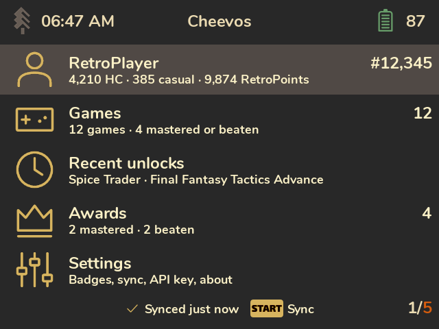

## Profile
One page with everything about your account. Scroll it with the D-pad (L1/R1 jump a page).
- Your rank, member date and when you were last active.
- Hardcore points, casual points and RetroPoints.
- **Last played:** the game and what you were doing in it (RetroAchievements' rich presence).
- **Player stats:** achievements unlocked, games beaten, RetroRatio, and how many of the games
  you started you've beaten.
- **Games by console:** how many games you've played, beaten and mastered, in total and on the
  five consoles you played most recently.

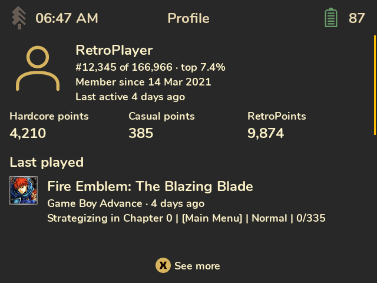

Press **X (See more)** for points earned in the last 7 and 30 days, average points per week,
average completion, a chart of the last 30 days, and every console you've played. The recent
points need Wi-Fi the first time: they're the only numbers fetched when you ask for them rather
than during sync.

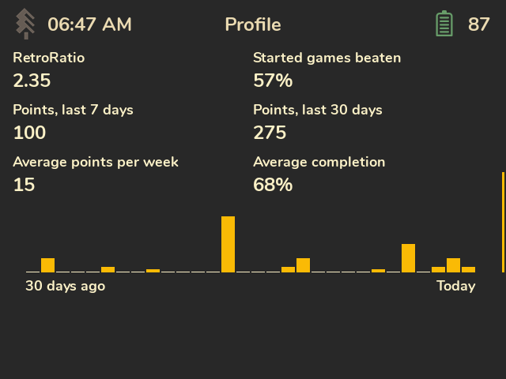

## Games
Every game you've played, newest activity first.

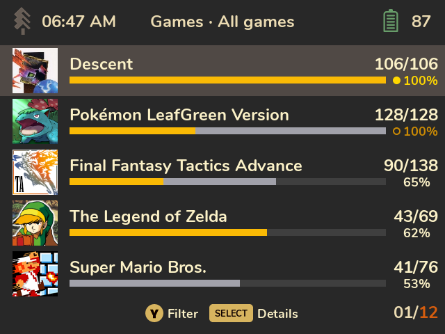

How to read a row:
- **The count** on the right is achievements unlocked out of the total, like on the site.
- **The bar** shows progress the way RetroAchievements does: **gold** for hardcore unlocks and
  **grey** for casual unlocks, side by side. A hardcore unlock counts as unlocked in both modes,
  so 30% gold plus 35% grey means 65% of the set.
- **The dot** marks an award: **gold** for mastered or completed, **silver** for beaten. Filled
  means hardcore, a hollow ring means casual. The percentage takes the same colour.

Press **Select** to switch between the bars and a details view (console, award or last activity).
Cheevos remembers your choice.

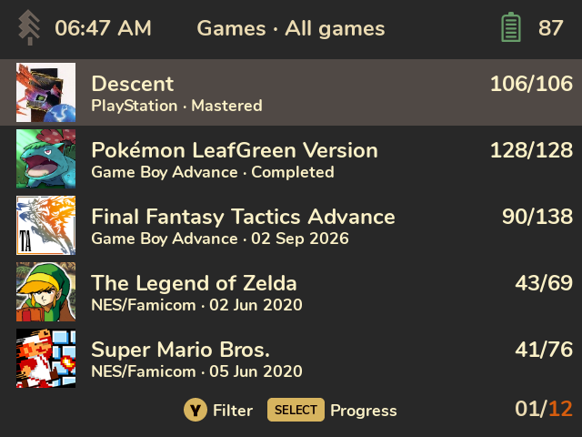

Press **Y** to filter (all, on this device, in progress, mastered or beaten, not started) or sort
(recent activity, title, console, completion). "On this device" lists games Spruce has already
recognised on your SD card (see [Limitations](Limitations.md)).

## A game's achievements
Every achievement with its badge, points, type and unlock date, or how rare it is if you haven't
unlocked it yet. "screenshot" means there's an unlock screenshot for it. The top bar shows how
many you've unlocked, with the game's award dot if it has one.

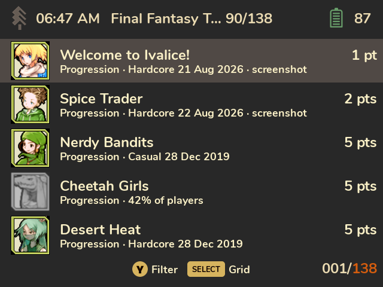

Press **Select** for a badge grid, and **Y** to filter (locked, unlocked, missable, progression
and win) or sort (points, rarity, unlocked first, and more).

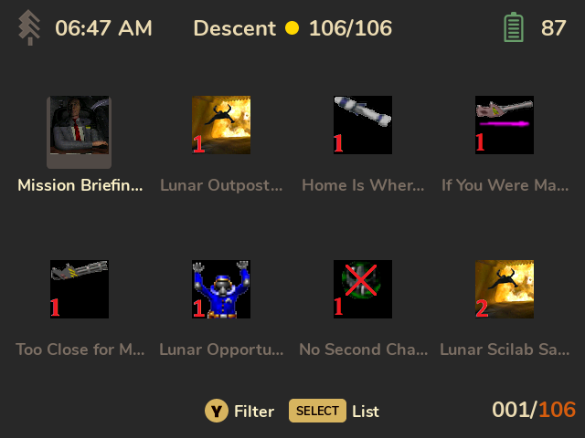

## An achievement
The badge, title, points, type, when you unlocked it, how many players have it, and the
description. If RetroArch saved a screenshot when you unlocked it, it's shown too: press **A**
for full screen.

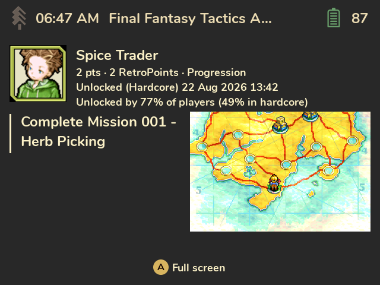

With **Hide locked descriptions** on (see [Settings](Settings.md)), a locked achievement shows
"Description hidden" instead; press **X** to reveal it.

## Recent unlocks
Your latest 100 unlocks across all games, newest first, saved during sync even when a game's
full achievement list hasn't been downloaded. Unlocks still waiting in RAOfflineProxy come
first, marked "Pending sync". Press **A** to open one. The card's title, description and unlock
date work offline; missing player statistics load in the background when you're online.
Until those statistics are available, rarity shows **—**.

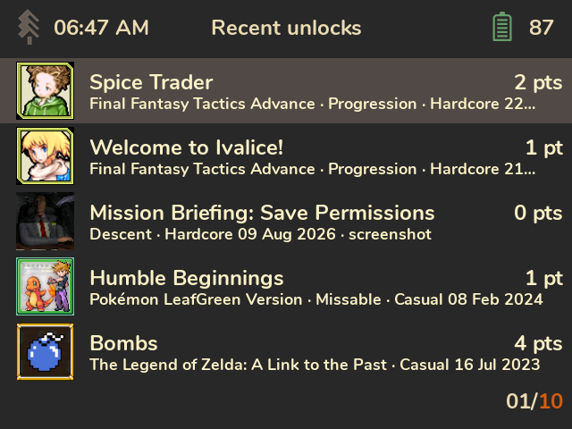

## Awards
Your mastered, completed and beaten games, one tile per game with its highest award. The frame
follows RetroAchievements' colours: **gold** for mastered (thick) and completed (thin),
**silver** for beaten in hardcore (thick) and in casual (thin). Press **A** to open the game,
**Y** to filter or sort, including your own order from the RetroAchievements site.

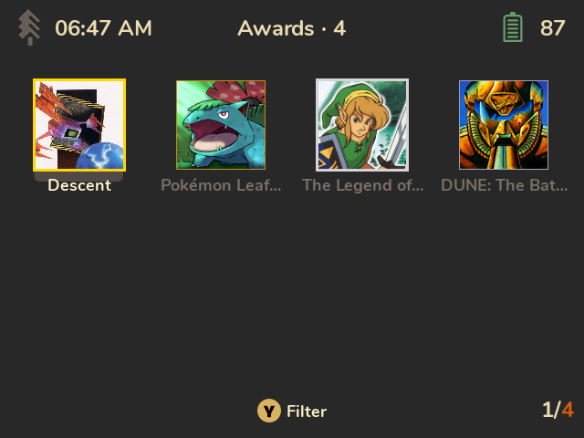

## Settings
See [Settings](Settings.md).

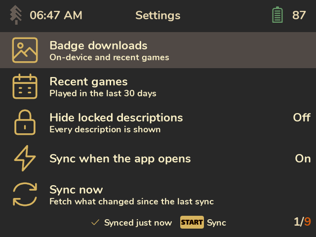
